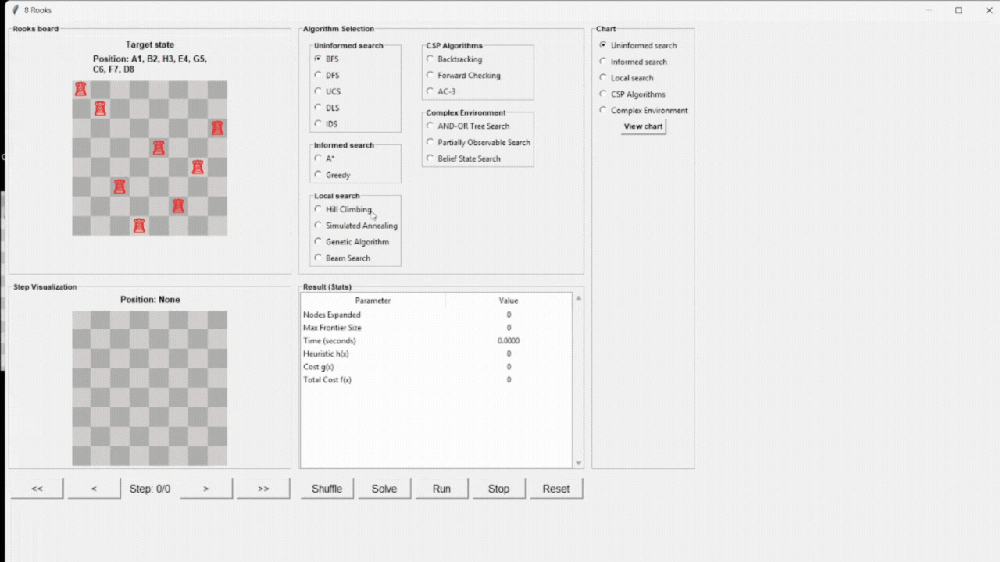
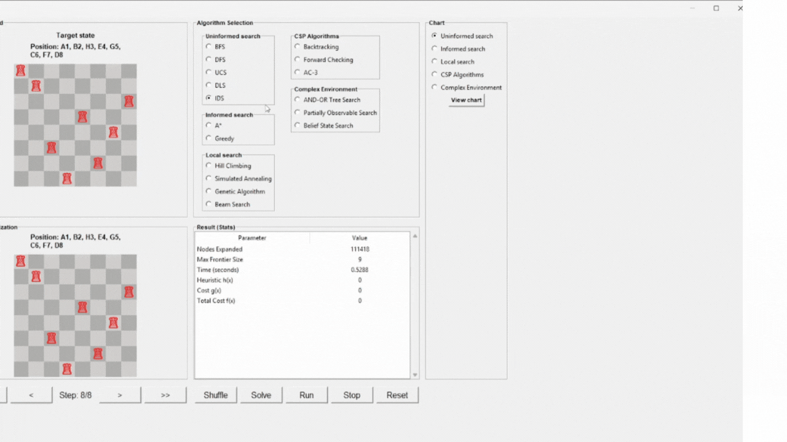
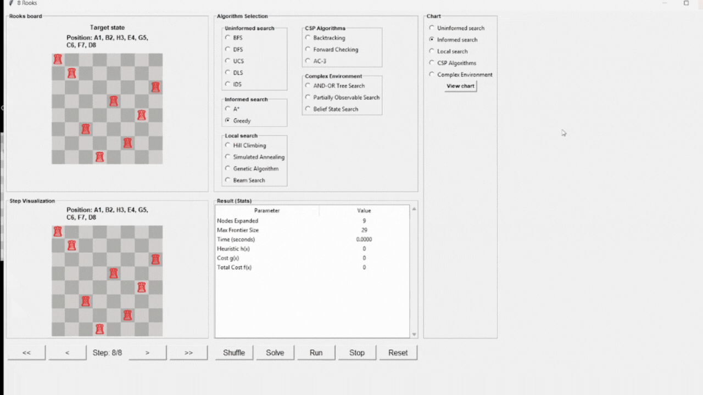
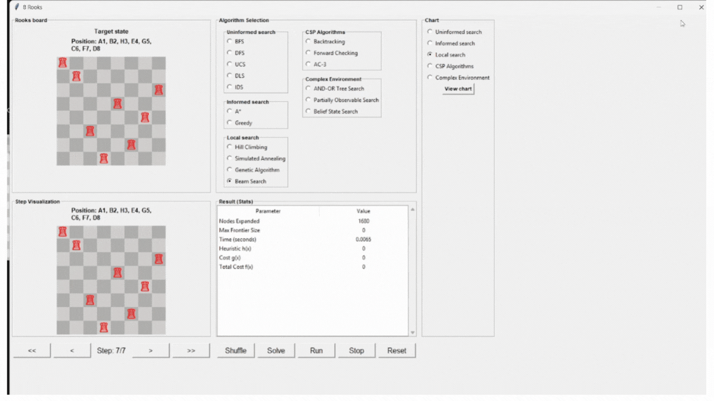
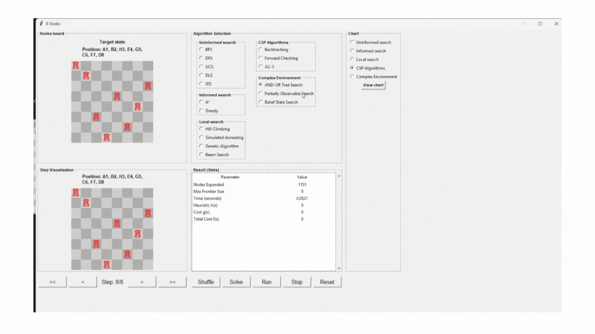

# BÁO CÁO ĐỒ ÁN CÁ NHÂN
# Ứng dụng các thuật toán tìm kiếm trong trí tuệ nhân tạo vào bài toán 8-Rooks

## Thông tin
- **Tên báo cáo:** Ứng dụng các thuật toán tìm kiếm trong trí tuệ nhân tạo vào bài toán 8-Rooks
- **GVHD:** TS.Phan Thị Huyền Trang
- **Môn Học:** Trí tuệ nhân tạo
- **Mã học phần:** 251ARIN330585_05CLC
- Học kỳ 2 - năm học 2024 - 2025
- **Sinh viên thực hiện:** Nguyễn Khánh
- **MSSV:** 23110112

## MỤC LỤC

- [VẤN ĐỀ](#vấn-đề)
  - [Bối cảnh](#bối-cảnh)
  - [Mục tiêu](#mục-tiêu)

- [CƠ SỞ LÝ THUYẾT](#cơ-sở-lý-thuyết)
  - [Bài toán 8 quân xe](#bài-toán-8-quân-xe)
  - [Cấu trúc đồ án](#cấu-trúc-đồ-án)
  - [Công nghệ được sử dụng trong đồ án](#công-nghệ-được-sử-dụng-trong-đồ-án)
  - [Các thuật toán tìm kiếm](#các-thuật-toán-tìm-kiếm)

- [THUẬT TOÁN](#thuật-toán)
  - [Thuật toán tìm kiếm không có thông tin](#thuật-toán-tìm-kiếm-không-có-thông-tin)
    - [Tìm kiếm theo chiều rộng (BFS)](#tìm-kiếm-theo-chiều-rộng-bfs)
    - [Thuật toán tìm kiếm theo chiều sâu (DFS)](#thuật-toán-tìm-kiếm-theo-chiều-sâu-dfs)
    - [Tìm Kiếm Chi Phí Đồng Nhất (UCS)](#tìm-kiếm-chi-phí-đồng-nhất-ucs)
    - [Tìm Kiếm Giới Hạn Độ Sâu (DLS)](#tìm-kiếm-giới-hạn-độ-sâu-dls)
    - [Tìm Kiếm Sâu Lặp (IDS)](#tìm-kiếm-sâu-lặp-ids)

  - [Thuật toán tìm kiếm có thông tin](#thuật-toán-tìm-kiếm-có-thông-tin)
    - [Tìm Kiếm Tham Lam (Greedy)](#tìm-kiếm-tham-lam-greedy)
    - [Tìm kiếm A* (A* Search)](#tìm-kiếm-a-a-search)

  - [Thuật toán tìm kiếm cục bộ](#thuật-toán-tìm-kiếm-cục-bộ)
    - [Thuật Toán Leo Đồi (Hill Climbing)](#thuật-toán-leo-đồi-hill-climbing)
    - [Tìm Kiếm Tôi Luyện Mô Phỏng (Simulated Annealing)](#tìm-kiếm-tôi-luyện-mô-phỏng-simulated-annealing)
    - [Tìm Kiếm Beam (Beam Search)](#tìm-kiếm-beam-beam-search)
    - [Thuật Toán Di Truyền (GA)](#thuật-toán-di-truyền-ga)

  - [Thuật toán tìm kiếm trong môi trường phức tạp](#thuật-toán-tìm-kiếm-trong-môi-trường-phức-tạp)
    - [And-Or Search](#and-or-search)
    - [Belief State Search](#belief-state-search)
    - [Partially Observable Search](#partially-observable-search)

  - [Bài toán thỏa mãn ràng buộc (CSP)](#bài-toán-thỏa-mãn-ràng-buộc-csp)
    - [Quay Lui (Backtracking)](#quay-lui-backtracking)
    - [Forward Checking](#forward-checking)
    - [Arc Consistency (AC-3)](#arc-consistency-ac-3)

- [CÁC HÀM TÍNH CHI PHÍ](#các-hàm-tính-chi-phí)
  - [Hàm đánh giá chi phí thực tế](#hàm-đánh-giá-chi-phí-thực-tế)
  - [Hàm đánh giá khoảng cách](#hàm-đánh-giá-khoảng-cách)

- [SO SÁNH HIỆU SUẤT](#so-sánh-hiệu-suất)
  - [Thuật toán không có thông tin](#thuật-toán-không-có-thông-tin)
  - [Thuật toán có thông tin](#thuật-toán-có-thông-tin)
  - [Thuật toán tìm kiếm cục bộ](#thuật-toán-tìm-kiếm-cục-bộ-1)
  - [Thuật toán tìm kiếm CSP](#thuật-toán-tìm-kiếm-csp)
  - [Thuật toán tìm kiếm trong môi trường phức tạp](#thuật-toán-tìm-kiếm-trong-môi-trường-phức-tạp-1)

- [KHỞI ĐỘNG TRÒ CHƠI](#khởi-động-trò-chơi)
- [KẾT LUẬN](#kết-luận)
- [HƯỚNG PHÁT TRIỂN](#hướng-phát-triển)
- [TÀI LIỆU THAM KHẢO](#tài-liệu-tham-khảo)

## VẤN ĐỀ
### Bối cảnh:
Bài toán 8 quân xe là một biến thể đơn giản hơn của bài toán kinh điển “8 quân hậu” trong lĩnh vực Trí tuệ nhân tạo (AI) và Bài toán thỏa mãn ràng buộc (CSP – Constraint Satisfaction Problem).
Trên bàn cờ vua kích thước 8×8, ta cần đặt 8 quân xe sao cho không có hai quân xe nào tấn công lẫn nhau.
### Mục tiêu:
- Ứng dụng các thuật toán tìm kiếm trong AI
- So sánh hiệu suất các thuật toán
- Xây dựng giao diện minh họa
- Tìm ra tất cả các cách (hoặc ít nhất một cách) sắp xếp 8 quân xe trên bàn cờ sao cho không có hai quân xe nào nằm cùng hàng hoặc cùng cột.

## CƠ SỞ LÝ THUYẾT
### BÀI TOÁN 8 QUÂN XE
Bài toán 8 quân xe là một ma trận 2D kích thước 8x8. Mục tiêu đặt các quân xe sao cho không có quân xe nào tấn công lẫn nhau.
**Ví dụ 1 trạng thái đích**
```
#example
. R . . . . . .
. . . R . . . .
. . . . . . R .
. . . . . R . .
R . . . . . . .
. . R . . . . .
. . . . R . . .
. . . . . . . R
```
- Vì khả năng máy tính cá nhân có hạn nên không gian trạng thái được hình thành dựa trên số quân được đặt trên mỗi hàng (Không tấn công lẫn nhau)
- Mỗi trạng thái ứng với việc đặt **k quân xe** đầu tiên, mỗi hàng một quân, không trùng cột.  
→ Số trạng thái có đúng `k` quân là hoán vị chập `k` của 8:
- `phép tính`:
\[
{}_{8}P_{k} = \frac{8!}{(8-k)!}
\]
- `Bảng chi tiết`
---
| k | Công thức          | Giá trị  |
|---|--------------------|----------:|
| 0 | 8! / 8!            | 1         |
| 1 | 8! / 7!            | 8         |
| 2 | 8! / 6!            | 56        |
| 3 | 8! / 5!            | 336       |
| 4 | 8! / 4!            | 1,680     |
| 5 | 8! / 3!            | 6,720     |
| 6 | 8! / 2!            | 20,160    |
| 7 | 8! / 1!            | 40,320    |
| 8 | 8! / 0!            | 40,320    |
- 40,320 trạng thái **hoàn chỉnh** (đặt đủ 8 quân).  
- 69,281 trạng thái **chưa đủ** (đặt từ 0 → 7 quân).  

### Cấu trúc đồ án
- `_pycache`
- `gif_baocao`: chứa file gif báo báo cá nhân
- `CSP.py`: chứa thuật toán Constraint Satisfaction Problem
- `Informed_search.py`: chứa thuật toán tìm kiếm có thông tin
- `Local_search`: thuật toán tìm kiếm cục bộ
- `Uninformed_search.py`: Thuật toán tìm kiếm không có thông tin
- `complex_env.py`: thuật toán tìm kiếm trong môi trường phức tạp
- `ui.py`: chứa giao diện

### Công nghệ được sử dụng trong đồ án
- **Ngôn ngữ lập trình:** Python 3.12.5
- **IDE:** Pycharm community edition 2025.2.1.1
- **Github:** Lưu trữ mã nguồnnguồn
- **Thư viện giao diện đồ họa:** tkinter
- **Thư viện hỗ trợ:**
  - `copy` – hỗ trợ sao chép đối tượng (deep copy)  
  - `random` – tạo số ngẫu nhiên, chọn phần tử ngẫu nhiên, tráo trộn  
  - `time` – đo thời gian chạy  
  - `collections.deque` – cấu trúc hàng đợi hai đầu (double-ended queue), dùng cho BFS hoặc hàng đợi hiệu quả  
  - `heapq` – cài đặt hàng đợi ưu tiên (priority queue) bằng heap  
  - `itertools` – cung cấp công cụ tạo tổ hợp, hoán vị, lặp vô hạn  
  - `math` – hỗ trợ các hàm toán học

### CÁC THUẬT TOÁN TÌM KIẾM
Các thuật toán tìm kiếm được phân loại thành các nhóm chính:
1. **Thuật toán tìm kiếm không có thông tin (Uninformed Search)**: Không sử dụng thông tin bổ sung về trạng thái để hướng dẫn quá trình tìm kiếm, chỉ dựa trên cấu trúc đồ thị trạng thái và mục tiêu.
2. **Thuật toán tìm kiếm có thông tin (Informed Search)**: Sử dụng hàm heuristic(h) để ước lượng chi phí đến mục tiêu, giúp tìm kiếm hiệu quả hơn, trên mục tiêu tìm kiếm theo hướng hứa hẹn nhất.
3. **Thuật toán tìm kiếm cục bộ (Local Search)**: Các thuật toán chỉ quan tâm đến trạng thái hiện tại (tùy bài toán) thay vì duyệt toàn bộ cây tìm kiếm
4. **Thuật toán thỏa mãn ràng buộc (CSP)**: Tìm giá trị cho các biến sao cho tất cả ràng buộc đều được thỏa mãn.
5. **Thuật toán cho môi trường phức tạp**: Từ môi trường phức tạp/không chắc chắn tìm kiếm lời giải cho bài toán

## THUẬT TOÁN
### Thuật toán tìm kiếm không có thông tin
#### Tìm kiếm theo chiều rộng (BFS) 
- **Nguyên lý:** Duyệt theo tầng — mở rộng tất cả trạng thái ở độ sâu hiện tại trước khi sang tầng sau, dùng hàng đợi (queue).
- **Ưu điểm:** Tìm được lời giải tối ưu (nếu có). Đảm bảo tìm thấy lời giải nếu tồn tại.
- **Nhược điểm**: Tốn bộ nhớ

#### Thuật toán tìm kiếm theo chiều sâu (DFS)
- **Nguyên lý:** Duyệt theo nhánh mở rộng một trạng thái đến độ sâu có thể trước khi quay lui. Sử dụng ngăn xếp (stack) để lưu trữ trạng thái.
- **Ưu điểm:**: Ít tốn bộ nhớ hơn so với BFS.    
- **Nhược điểm:** Có thể rơi vào vòng lặp hoặc đi sâu vào nhánh sai. Không đảm bảo tìm được lời giải tối ưu.

#### Tìm Kiếm Chi Phí Đồng Nhất (UCS)
- **Nguyên lý:** Thuật toán luôn mở rộng trạng thái có chi phí đường đi nhỏ nhất từ trạng thái ban đầu. Sử dụng hàng đợi ưu tiên (priority queue) để chọn nút có tổng chi phí thấp nhất.
- **Ưu điểm:**  Đảm bảo tìm được đường đi tối ưu nếu tất cả chi phí là dương. Hoạt động tốt cho các bài toán có trọng số khác nhau giữa các bước di chuyển.  
- **Nhược điểm:**  Tốc độ chậm nếu không có giới hạn chi phí hoặc đồ thị quá lớn. Cần sử dụng nhiều bộ nhớ để lưu hàng đợi ưu tiên.

#### Tìm Kiếm Giới Hạn Độ Sâu (DLS)
- **Nguyên lý:** Là biến thể của DFS, nhưng đặt một giới hạn độ sâu (limit) để tránh việc thuật toán đi quá sâu vào nhánh vô hạn. Khi đạt tới giới hạn này, thuật toán quay lui (backtrack) mà không mở rộng thêm.
- **Ưu điểm:** Tránh rơi vào vòng lặp vô hạn như DFS thông thường. Tiết kiệm bộ nhớ.  
- **Nhược điểm:** Có thể bỏ sót lời giải nếu giới hạn độ sâu nhỏ hơn độ sâu thực tế của lời giải.  

#### Tìm Kiếm Sâu Lặp (Iterative Deepening Search – IDS)
- **Nguyên lý:** Là sự kết hợp giữa DFS và BFS. Sử dụng DLS (Depth-Limited Search) làm hàm con. Thuật toán thực hiện tìm kiếm giới hạn độ sâu (DLS) nhiều lần, mỗi lần tăng giới hạn độ sâu thêm 1, cho đến khi tìm được lời giải. 
- **Ưu điểm:** Sẽ tìm thấy lời giải nếu tồn tại. Đảm bảo lời giải tối ưu khi chi phí giữa các bước là bằng nhau. Tiết kiệm bộ nhớ hơn BFS. Tránh vòng lặp vô hạn như DFS.  
- **Nhược điểm:** Phải duyệt lại nhiều lần các nút ở độ sâu nhỏ hơn.

### Thuật toán tìm kiếm có thông tin
#### Tìm Kiếm Tham Lam (Greedy Best-First Search)
- **Nguyên lý:** Thuật toán sử dụng hàm heuristic h(n) để ước lượng khoảng cách từ trạng thái hiện tại đến đích và luôn chọn mở rộng trạng thái có giá trị heuristic nhỏ nhất (priority queue).
- **Công thức đánh giá:**  
> f(n) = h(n)
- **Ưu điểm:** Tốc độ nhanh, mở rộng ít trạng thái hơn trong nhiều trường hợp. Hiệu quả cao khi hàm heuristic được thiết kế tốt.  
- **Nhược điểm:** Không đảm bảo tìm được lời giải tối ưu, vì bỏ qua chi phí thực tế.  

#### Tìm kiếm A* (A* Search)
- **Nguyên lý:** Tổng chi phí thực tế từ điểm bắt đầu đến nút hiện tại g(n) và ước lượng chi phí từ nút hiện tại đến đích(h(n).  
- Thuật toán mở rộng các nút có giá trị nhỏ nhất trong hàng đợi ưu tiên (priority queue).  
> f(n) = g(n) + h(n)  
- **Ưu điểm:**: Kết hợp được tốc độ của tìm kiếm tham lam và độ chính xác của tìm kiếm chi phí đồng nhất. Đảm bảo tìm được lời giải tối ưu nếu heuristic chấp nhận được (admissible).  
- **Nhược điểm:** Tốn nhiều bộ nhớ, do phải lưu toàn bộ các nút đã mở rộng.  Phụ thuộc vào chất lượng của hàm heuristic.

### Thuật toán tìm kiếm cục bộ
#### Thuật Toán Leo Đồi (Hill Climbing)
- **Nguyên lý:** Bắt đầu từ một trạng thái ban đầu và liên tục di chuyển sang trạng thái lân cận tốt hơn dựa trên giá trị của hàm đánh giá (heuristic).  
- **Ưu điểm:** Hiệu quả với không gian trạng thái lớn (không cần duyệt toàn bộ).  
- **Nhược điểm:** Có thể mắc kẹt tại cực đại cục bộ (local maximum). Không đảm bảo tìm được nghiệm tối ưu toàn cục.

#### Tìm Kiếm Tôi Luyện Mô Phỏng (Simulated Annealing)
**Nguyên lý:** Thuật toán mô phỏng quá trình tôi luyện kim loại, bắt đầu với nhiệt độ cao
(cho phép chấp nhận các trạng thái kém hơn) và giảm dần nhiệt độ theo thời gian. Khi nhiệt độ cao, thuật toán có thể chấp nhận bước di chuyển tệ hơn để thoát khỏi cực trị cục bộ. Khi nhiệt độ giảm, thuật toán chỉ chấp nhận các bước cải thiện.
- **Công thức xác suất chấp nhận bước tệ hơn:**  
\[
P = e^{-\Delta E / T}
\]
  - Trong đó:  
  - \( \Delta E = E_{\text{next}} - E_{\text{current}} \) là sự thay đổi năng lượng (hoặc chi phí).  
  - \( T \) là nhiệt độ hiện tại.  
  - \( P \) là xác suất chấp nhận bước tệ hơn.
- **Ưu điểm:** Có khả năng thoát khỏi cực trị cục bộ mà Hill Climbing mắc phải. Thường tìm được lời giải tốt hơn Hill Climbing trong không gian trạng thái lớn.
- **Nhược điểm:** Tốc độ chậm hơn các thuật toán, kết quả phụ thuộc mạnh vào các tham số.

#### Tìm Kiếm Beam (Beam Search)
- **Nguyên lý:** Beam Search là biến thể của Breadth-First Search nhưng giới hạn số lượng trạng thái mở rộng tại mỗi mức (beam width = k). Thuật toán chỉ giữ k trạng thái tốt nhất theo hàm heuristic tại mỗi bước. Các trạng thái còn lại bị loại bỏ
- **Ưu điểm:** Giảm đáng kể bộ nhớ và số trạng thái cần xét so với BFS, giảm nguy cơ kẹt trong local maximum. Hiệu quả với không gian trạng thái lớn.   
- **Nhược điểm:**  Không đảm bảo tìm được lời giải tối ưu, vì các trạng thái tốt có thể bị loại bỏ sớm.  

#### Thuật Toán Di Truyền (Genetic Algorithm – GA)
- **Nguyên lý:** Genetic Algorithm mô phỏng quá trình tiến hóa sinh học để tìm lời giải tối ưu.
  1. **Khởi tạo**: Tạo quần thể ban đầu gồm nhiều cá thể (trạng thái khả thi).  
  2. **Đánh giá**: Sử dụng **hàm fitness** để đánh giá chất lượng từng cá thể.  
  3. **Chọn lọc (Selection)**: Chọn các cá thể tốt hơn để làm cha mẹ.  
  4. **Crossover**: Kết hợp các cá thể cha mẹ để tạo ra thế hệ con.  
  5. **Mutation**: Thay đổi ngẫu nhiên một số gene để duy trì tính đa dạng.  
  6. **Lặp lại** các bước trên cho đến khi đạt điều kiện dừng (số thế hệ, fitness đạt chuẩn, hoặc tìm được lời giải tối ưu).  
- **Ưu điểm:**  Thích hợp cho không gian trạng thái lớn và phức tạp, khám phá toàn cục.
- **Nhược điểm:**  tham số kích thước quần thể, xác suất crossover, mutation rate, số thế hệ cần phù hợp. Tốn thời gian cho các quần thể lớn.  

### Thuật toán tìm kiếm trong môi trường phức tạp
#### And-Or Search
- **Nguyên lý:** And-Or Search được sử dụng trong môi trường không chắc chắn hoặc **có hành động kết hợp (and/or). **OR nodes**: Chọn một trong các hành động khả thi để đạt mục tiêu. **AND nodes**: Tất cả các hành động con đều phải thành công để đạt mục tiêu.   
- **Ưu điểm:** Thích hợp cho **môi trường có nhiều kết quả ngẫu nhiên** (stochastic environment).  
- **Nhược điểm:** Tốn bộ nhớ và thời gian khi không gian trạng thái lớn.
- 
#### Belief State Search
- **Nguyên lý:** Belief State Search được dùng khi môi trường không chắc chắn hoặc thông tin bị giới hạn. Thuật toán lưu tập hợp các trạng thái có thể xảy ra (belief state). Khi thực hiện một hành động, belief state được cập nhật. Thuật toán mở rộng tập hợp các belief state để tìm kiếm trạng thái mục tiêu.
- **Ưu điểm:** Thích hợp cho môi trường không quan sát được thông tin. 
- **Nhược điểm:**  Không gian belief state rất lớn, tốn bộ nhớ và thời gian. Cần cập nhật belief state sau mỗi hành động.
- 
#### Partially Observable Search
- **Nguyên lý:** Partially Observable Search được sử dụng khi môi trường chỉ quan sát được một phần thông tin (partial observability). Trạng thái thực tế có thể không biết đầy đủ. Thuật toán duy trì tập hợp các trạng thái belief states dựa trên thông tin được biết một phần.
- **Ưu điểm:** Phù hợp cho môi trường thông tin không đầy đủ.
- **Nhược điểm:** Tốn bộ nhớ và tài nguyên tính toán do phải quản lý tập hợp các trạng thái belief state.

### Bài toán thỏa mãn ràng buộc (Constraint Satisfaction Problem)
#### Quay Lui (Backtracking)
- **Nguyên lý:** Duyệt không gian trạng thái theo chiều sâu, gán giá trị cho từng biến. Khi một ràng buộc bị vi phạm, thuật toán quay lui (backtrack) để thử giá trị khác.  
- **Ưu điểm:** Dễ cài đặt.     
- **Nhược điểm:** Khi không gian trạng thái lớn thì tốn nhiều bộ nhớ và thời gian.
- 
#### Forward Checking
- **Nguyên lý:** Khi gán giá trị cho một biến, thuật toán kiểm tra trước (forward) các biến chưa gán, loại bỏ các giá trị trong miền của biến còn lại mà **sẽ gây vi phạm ràng buộc**. Nếu một biến chưa gán không còn giá trị hợp lệ, thuật toán quay lui ngay thay vì tiếp tục duyệt sâu.  
- **Ưu điểm:** Giảm số nhánh phải thử so với Backtracking. Phát hiện vi phạm ràng buộc giúp giảm thời gian  
- **Nhược điểm:** Cần tính toán và cập nhật miền giá trị liên tục
- 
#### Arc Consistency (AC-3)
- **Nguyên lý:** Mỗi arc (Xi, Xj) được coi là consistent nếu mọi giá trị của Xi có ít nhất một giá trị hợp lệ tương ứng trong Xj.
  - Thuật toán lặp đi lặp lại:  
    1. Lấy một arc (Xi, Xj) từ hàng đợi.  
    2. Loại bỏ các giá trị của Xi **không có giá trị hợp lệ tương ứng trong Xj**.  
    3. Nếu có thay đổi, thêm lại các arc liên quan đến Xi vào hàng đợi. Quá trình lặp lại đến khi không còn giá trị nào cần loại bỏ.
- **Ưu điểm:** Giảm miền giá trị trước khi hoặc trong quá trình Backtracking. Giúp phát hiện các trạng thái không có nghiệm thỏa mãn 
- **Nhược điểm:**  AC-3 không đảm bảo tìm lời giải, chỉ lọc giá trị không hợp lệ.  

## CÁC HÀM TÍNH CHI PHÍ
### Hàm đánh giá chi phí thực tế
`manhattan_chain_cost(board)`
1. Lấy danh sách các quân Rook trên bàn cờ (board), đồng thời ghi nhận các hàng đã có quân.  
2. Tính tổng khoảng cách Manhattan giữa các quân Rook theo thứ tự xuất hiện:  
   \[
   \text{cost} = \sum_{i=1}^{k-1} \big( |r_i - r_{i+1}| + |c_i - c_{i+1}| \big)
   \]  
   với \( (r_i, c_i) \) là tọa độ quân thứ i.
### Hàm đánh giá khoảng cách
`manhattan_distance_rooks(board, target)`
1. Duyệt từng **hàng của bàn cờ**.  
2. Nếu hàng có quân Rook, lấy **cột hiện tại** và **cột mục tiêu**.  
3. Tính khoảng cách Manhattan trên hàng so với mục tiêu:  
   \[
   \text{distance} = \sum_{r=0}^{N-1} |c_{\text{current}} - c_{\text{target}}|
   \]  
4. Tổng tất cả các khoảng cách để ra chi phí heuristic.

## SO SÁNH HIỆU SUẤT
### Thuật toán không có thông tin
- **BFS:** Dễ triển khai, đảm bảo tìm được lời giải tối ưu cho bài toán 8 rooks, nhưng tiêu tốn nhiều bộ nhớ khi không gian trạng thái lớn.
- **DFS:** Tiết kiệm bộ nhớ hơn BFS, nhưng có thể dẫn đến lời giải không tối ưu hoặc rơi vào nhánh sai lâu.
- **UCS:** Tìm được lời giải tối ưu nếu chi phí di chuyển đồng nhất, nhưng không hiệu quả khi không cần đánh giá chi phí.
- **DLS:** Giới hạn độ sâu tìm kiếm giúp tránh lan rộng vô hạn, song có thể bỏ lỡ lời giải nếu đặt giới hạn chưa đủ.
- **IDS:** Kết hợp ưu điểm của BFS và DFS, tìm được lời giải tối ưu với bộ nhớ nhỏ, tuy nhiên tốn thời gian do phải lặp lại các mức tìm kiếm trước đó.

### Thuật toán có thông tin
- **Greedy:** Tốc độ tìm kiếm nhanh trong bài toán 8 quân xe, nhưng có thể dừng ở nghiệm chưa tối ưu.
- **A-star:** Kết hợp giữa tốc độ và tính tối ưu, hoạt động hiệu quả nhờ sử dụng hàm heuristic và chi phí thực tế là số lượng quân xe trên bàn cờ để định hướng tìm kiếm.

### Thuật toán tìm kiếm cục bộ
- **Hill Climbing:** Tìm kiếm nhanh nhưng dễ bị mắc kẹt ở cực tiểu cục bộ, không đảm bảo tìm được nghiệm tối ưu.
- **Simulated Annealing:** Có khả năng thoát khỏi cực tiểu cục bộ nhờ chấp nhận tạm thời nghiệm kém hơn, giúp tăng cơ hội đạt nghiệm tối ưu toàn cục.
- **Beam Search:** Giữ lại nhiều nhánh triển vọng cùng lúc, giảm nguy cơ mắc kẹt cục bộ, nhưng hiệu quả phụ thuộc vào giá trị beam width.
- **Genetic Algorithm:** Dựa trên cơ chế tiến hóa tự nhiên, tạo ra thế hệ lời giải mới qua lai ghép và đột biến, có khả năng tìm được nghiệm tốt nhưng tốn thời gian tính toán.

### Thuật toán tìm kiếm CSP
- **Backtracking:** Thuật toán tìm kiếm quay lui, hoạt động nhanh trong không gian nhỏ nhưng không đảm bảo luôn tìm được lời giải tối ưu.
- **Forward Checking:** Giúp giảm không gian tìm kiếm bằng cách loại bỏ sớm các giá trị không hợp lệ trong miền của biến liên quan, nhờ đó tránh được nhiều nhánh sai.
- **AC3:** Thuật toán duy trì tính nhất quán cung, liên tục kiểm tra và loại bỏ các giá trị không thỏa ràng buộc giữa các biến, giúp tăng hiệu quả và giảm số nút cần mở rộng trong quá trình tìm kiếm.

### Thuật toán tìm kiếm trong môi trường phức tạp
- **AND-OR Tree Search:** Có thể giải được bài toán nhưng tiêu tốn nhiều tài nguyên do tạo ra nhiều kế hoạch dư thừa.
- **Partially Observable Search:** Không cần thiết vì trạng thái của bài toán luôn được quan sát đầy đủ.
- **Belief State Search:** Rất chậm và tốn bộ nhớ vì không có yếu tố không chắc chắn cần xử lý.


## Khởi động trò chơi
- Chạy trực tiếp file 
```ui.py```

### Tính năng


- Rooks board: Hiển thị trạng thái mục tiêu và vị trí các quân cờ
- Step Visualization: Hiển thị các bước đặt quân cờ. Bên dưới có các nút điều khiển hiển thị trước hoặc sau 
- Algorithm Selection: Lựa chọn thuật toán để chạy
- Result (Stats): Hiển thị thông tin thuật toán sau khi hoàn thành
- Các nút điều khiển:
  - Shuffle: Trộn các quân cờ mục tiêu
  - Solve: Giải dùng thuật toán tìm trạng thái mục tiêu
  - Run: Chạy hiển thị (Step Visualization)
  - Stop: Ngừng hiển thị (Step Visualization)
  - Reset: Xóa hiển thị trên (Step Visualization)
- Chart: Chọn nhóm thuật toán và nhấn view chart để hiển thị thông tin so sánh

## Kết luận
- Qua quá trình triển khai và thử nghiệm các thuật toán tìm kiếm trên bài toán 8 quân xe, có thể thấy mỗi thuật toán đều có ưu và nhược điểm riêng.
- Các thuật toán tìm kiếm mù như BFS, DFS, UCS, DLS, IDS hoạt động hiệu quả với không gian trạng thái nhỏ nhưng tiêu tốn nhiều tài nguyên khi mở rộng.
- Các thuật toán tìm kiếm có thông tin như Greedy, A*, Hill Climbing, Simulated Annealing, Beam Search, và Genetic Algorithm cho thấy khả năng cải thiện tốc độ và tối ưu hóa tìm kiếm, đặc biệt khi được hỗ trợ bởi hàm heuristic phù hợp.
- Các phương pháp như Backtracking, Forward Checking, và AC3 góp phần giảm đáng kể số trạng thái cần xem xét, giúp nâng cao hiệu quả giải bài toán ràng buộc.
- Tuy nhiên, một số phương pháp nâng cao như AND-OR Tree Search, Partially Observable Search, hay Belief State Search ít phù hợp do đặc tính trạng thái rõ ràng và không có yếu tố bất định.

## Hướng phát triển
- Tối ưu và kết hợp các thuật toán heuristic nhằm đạt hiệu suất cao hơn.
- Ứng dụng giao diện trực quan (visualization) để minh họa quá trình tìm kiếm của từng thuật toán.
- Nghiên cứu và áp dụng các thuật toán học máy hoặc tìm kiếm tiến hóa để giải quyết các biến thể phức tạp hơn của bài toán.

## Tài liệu tham khảo
1. Russell, S. J., & Norvig, P. (2020). Artificial Intelligence: A Modern Approach (4th Edition). Pearson.
2. Poole, D. L., & Mackworth, A. K. (2017). Artificial Intelligence: Foundations of Computational Agents (2nd Edition). Cambridge University Press.
3. Nilsson, N. J. (1998). Artificial Intelligence: A New Synthesis. Morgan Kaufmann Publishers.
